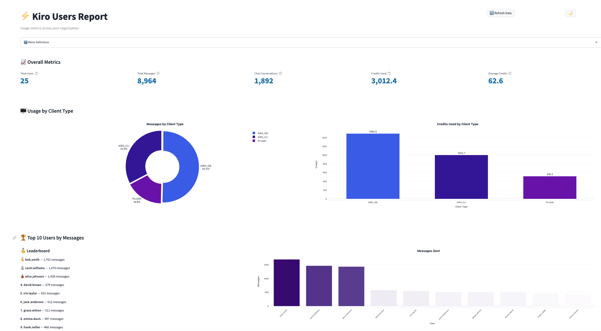
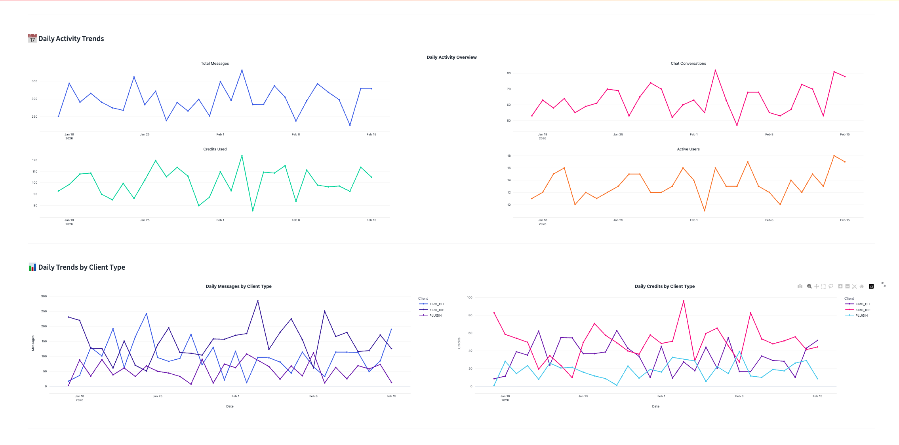
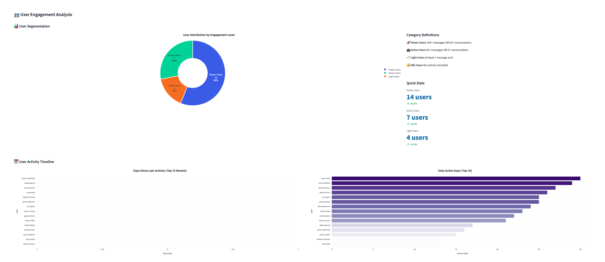
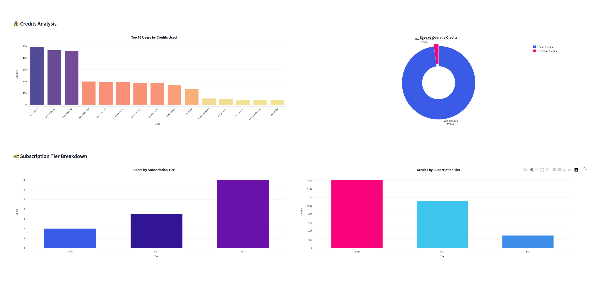
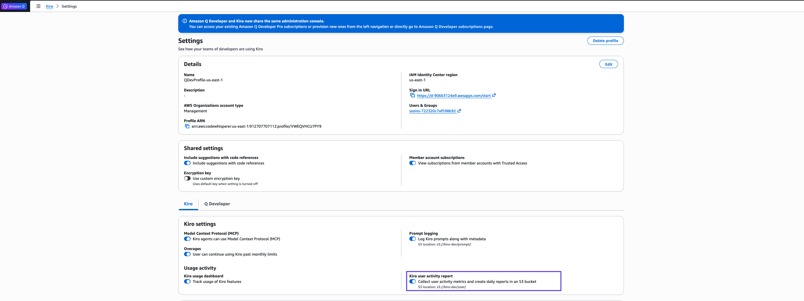

# ⚡ Kiro Users Report

A Streamlit dashboard for visualizing Kiro usage metrics. Connects to your Kiro user report data in S3 via AWS Glue and Athena, and presents interactive charts covering messages, conversations, credits, client types, user engagement, and more.







## Prerequisites

- Kiro user report data export enabled in the AWS console (see below)
- [Terraform](https://www.terraform.io/downloads) >= 1.0
- [AWS CLI](https://aws.amazon.com/cli/) configured with appropriate credentials
- Python 3.8+

## Enable Kiro User Reports

Before using this dashboard, you need to enable user report data export in the AWS console. Navigate to the Kiro settings page and configure the S3 bucket where user reports will be delivered.



Once enabled, Kiro will deliver daily user report CSV files to your specified S3 bucket.

For detailed instructions, see the [Kiro User Activity documentation](https://kiro.dev/docs/enterprise/monitor-and-track/user-activity/).

## Quick Start

```bash
git clone https://github.com/aws-samples/sample-kiro-user-analytics-dashboard.git
cd sample-kiro-user-analytics-dashboard

# 1. Configure your variables
cp terraform/terraform.tfvars.example terraform/terraform.tfvars
# Edit terraform/terraform.tfvars with your values (see Configuration below)

# 2. Deploy everything (infra + crawler + app config)
./deploy.sh

# 3. Start the dashboard
cd app
pip install -r requirements.txt
streamlit run app.py
```

The dashboard will be available at `http://localhost:8501`.

## Configuration

Edit `terraform/terraform.tfvars` with your values:

| Variable | Required | Description |
|---|---|---|
| `aws_region` | No (default: `us-east-1`) | AWS region for all resources |
| `aws_account_id` | Yes | Your AWS account ID |
| `s3_bucket_name` | Yes | S3 bucket name including prefix (e.g. `kiro-dev/user`) |
| `glue_database_name` | No | Glue catalog database name |
| `glue_crawler_schedule` | No | Cron schedule for the Glue crawler |
| `identity_store_id` | Yes | IAM Identity Center Identity Store ID (e.g. `d-1234567890`) for resolving user IDs to usernames |
| `project_name` | No | Prefix for resource naming |
| `tags` | No | Tags applied to all resources |

The S3 data path is constructed automatically as:
```
s3://{s3_bucket_name}/AWSLogs/{aws_account_id}/KiroLogs/user_report/{aws_region}/
```

> The Glue table name is auto-discovered from the database at runtime — no need to configure it manually.

## What `deploy.sh` Does

1. Runs `terraform init` and `terraform apply` to provision:
   - Glue database, crawler, and IAM role
   - Athena workgroup and results S3 bucket
   - IAM policies for app access
2. Generates `app/.env` from Terraform outputs
3. Starts the Glue crawler and waits for it to finish

After that, you just start the Streamlit app.

## Data Schema

The dashboard expects Kiro user report CSV data with these columns:

| Column | Type | Description |
|---|---|---|
| `date` | string | Date of the report activity (YYYY-MM-DD) |
| `userid` | string | ID of the user for whom the activity is reported |
| `client_type` | string | `KIRO_IDE`, `KIRO_CLI`, or `PLUGIN` |
| `chat_conversations` | integer | Number of conversations by the user during the day |
| `credits_used` | double | Credits consumed from the user subscription plan during the day |
| `overage_cap` | double | Overage limit set by admin (or max credits for plan if overage not enabled) |
| `overage_credits_used` | double | Total overage credits used, if overage is enabled |
| `overage_enabled` | string | Whether overage is enabled for this user |
| `profileid` | string | Profile associated with the user activity |
| `subscription_tier` | string | Kiro subscription plan (Pro, ProPlus, Power) |
| `total_messages` | integer | Messages sent to and from Kiro (prompts, tool calls, responses) |

## Dashboard Sections

- Overall Metrics — users, messages, conversations, credits, overage
- Usage by Client Type — KIRO_CLI vs KIRO_IDE breakdown
- Top 10 Users — leaderboard by messages
- Daily Activity Trends — messages, conversations, credits, active users over time
- Daily Trends by Client Type — per-client daily line charts
- Credits Analysis — top users by credits, base vs overage split
- Subscription Tier Breakdown — users and credits by tier
- User Engagement — segmentation (Power / Active / Light / Idle)
- User Activity Timeline — recency, active days, filterable detail table
- Engagement Funnel — conversion rates across engagement stages

## Project Structure

```
.
├── deploy.sh                        # One-click deploy script
├── terraform/
│   ├── main.tf                      # Glue, Athena, S3, IAM resources
│   ├── variables.tf                 # Input variables
│   ├── outputs.tf                   # Outputs (fed into app/.env)
│   └── terraform.tfvars.example     # Example configuration
└── app/
    ├── app.py                       # Streamlit dashboard
    ├── config.py                    # Environment variable loader
    ├── requirements.txt             # Python dependencies
    └── .env.example                 # Example environment file
```

## Security

See [CONTRIBUTING](CONTRIBUTING.md#security-issue-notifications) for more information.

## License

This library is licensed under the MIT-0 License. See the [LICENSE](LICENSE) file.
